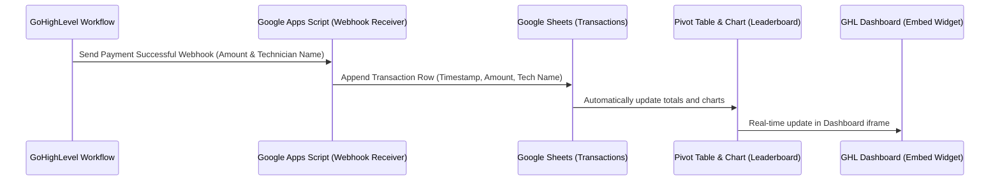

# 2026 Plumbing SaaS: Real-Time Technician Collections Leaderboard Setup Guide

This guide walks you through setting up a **real-time collections leaderboard** for your technicians, completely free of charge, using **Google Sheets + Google Apps Script + GoHighLevel (GHL)**.

---

## Architecture Overview



---

## Part 1: Google Sheet Setup

1. Create a new **Google Sheet** and name it `[PLMB] Technician Collections Board`.
2. Rename the first tab to **`Transactions`**.
3. Create the following headers in row 1:
   - **Column A:** `Timestamp`
   - **Column B:** `Amount`
   - **Column C:** `Technician`
   - **Column D:** `Contact Name`

---

## Part 2: Google Apps Script Webhook Receiver

This script acts as a Webhook listener. It receives data from GHL, parses the payment details, and appends them to your sheet in real-time.

1. In your Google Sheet, click **Extensions > Apps Script** from the top menu.
2. Delete any default code in the editor and paste the following script:

```javascript
/**
 * POST Webhook Receiver for GoHighLevel
 * Appends payment amount and assigned technician to the Google Sheet.
 */
function doPost(e) {
  try {
    var ss = SpreadsheetApp.getActiveSpreadsheet();
    var sheet = ss.getSheetByName("Transactions");
    
    // Create sheet if it does not exist
    if (!sheet) {
      sheet = ss.insertSheet("Transactions");
      sheet.appendRow(["Timestamp", "Amount", "Technician", "Contact Name"]);
    }
    
    // Parse the incoming Webhook JSON payload
    var data = JSON.parse(e.postData.contents);
    Logger.log("Incoming Webhook Data: " + JSON.stringify(data));
    
    // 1. Extract Payment Amount (supports GHL opportunity values or custom params)
    var amount = 0;
    if (data.amount !== undefined) {
      amount = parseFloat(data.amount);
    } else if (data.opportunity && data.opportunity.value !== undefined) {
      amount = parseFloat(data.opportunity.value);
    }
    
    // 2. Extract Technician Name (supports custom params or GHL custom fields)
    var technician = "Unknown";
    if (data.technician) {
      technician = data.technician;
    } else if (data.opportunity && data.opportunity.customFields) {
      // Find the Technician_Assigned custom field from GHL
      var fields = data.opportunity.customFields;
      for (var key in fields) {
        if (key.toLowerCase().includes("technician") || fields[key].id === "Technician_Assigned") {
          technician = fields[key].value || fields[key];
          break;
        }
      }
    }
    
    // 3. Extract Contact Name
    var contactName = "Customer";
    if (data.contactName) {
      contactName = data.contactName;
    } else if (data.contact) {
      var firstName = data.contact.first_name || "";
      var lastName = data.contact.last_name || "";
      contactName = (firstName + " " + lastName).trim() || "Customer";
    }
    
    // Append the row to the sheet
    sheet.appendRow([
      new Date(),       // Timestamp
      amount,           // Amount ($)
      technician,       // Technician Assigned
      contactName       // Contact Name
    ]);
    
    // Return success response to GHL
    return ContentService.createTextOutput(JSON.stringify({
      status: "success",
      message: "Transaction recorded successfully"
    })).setMimeType(ContentService.MimeType.JSON);
    
  } catch (error) {
    Logger.log("Error processing webhook: " + error.toString());
    return ContentService.createTextOutput(JSON.stringify({
      status: "error",
      message: error.toString()
    })).setMimeType(ContentService.MimeType.JSON);
  }
}
```

### Deploy the Script as a Web App:
1. Click the blue **Deploy** button at the top right of the editor, then select **New deployment**.
2. Click the gear icon next to "Select type" and choose **Web app**.
3. Fill in the deployment details:
   - **Description:** `GHL Leaderboard Webhook`
   - **Execute as:** `Me (your email)`
   - **Who has access:** `Anyone` (Crucial! GoHighLevel needs access to send POST data).
4. Click **Deploy**.
5. Copy the **Web app URL** (this is your Webhook endpoint). It will look like:
   `https://script.google.com/macros/s/XXXXX/exec`

---

## Part 3: Pivot Table & Chart Setup (Leaderboard)

1. Select your `Transactions` sheet.
2. Select all columns (A to D) and click **Insert > Pivot table**.
3. Choose **New sheet** and click **Create**. Rename this tab to **`Leaderboard`**.
4. In the Pivot Table editor on the right:
   - **Rows:** Add **`Technician`**.
   - **Values:** Add **`Amount`** (set to **`SUM`**).
   - **Filters:** Add **`Timestamp`** (Optional: Filter to show only today/this week if desired).
   - **Sort by:** Select **`SUM of Amount`** and set order to **`Descending`** (highest revenue first).
5. Now, select your Pivot Table data, and click **Insert > Chart**.
6. Customize the chart in the editor:
   - **Chart Type:** 3D Pie Chart or horizontal **Bar Chart** (Best for leaderboard comparisons).
   - **Title:** `Technician Sales Leaderboard`
   - Apply a premium, clean theme matching your brand colors.

---

## Part 4: Publish your Chart Link

1. Click on the 3 dots at the top-right corner of your chart and select **Publish chart**.
2. Under the Link tab, select:
   - **Content:** Choose your chart name (not the entire document).
   - **Type:** `Interactive`.
3. Click **Publish** and confirm.
4. Copy the generated **Publish URL**. It will look like:
   `https://docs.google.com/spreadsheets/d/e/2PACX-XXXXX/pubchart?oid=YYYYY&format=interactive`

---

## Part 5: GoHighLevel (GHL) Workflow Webhook Configuration

To send the details automatically when a payment is successful, configure this GHL workflow:

1. Create a new **Workflow** in GHL triggered by **Payment Status** (Successful).
2. Add a **Custom Webhook** action:
   - **Method:** `POST`
   - **URL:** Paste your Google Apps Script **Web App URL** from Part 2.
   - **Payload Type:** `Custom Payload` (Select Custom to send clean parameters):
     ```json
     {
       "amount": "{{opportunity.value}}",
       "technician": "{{opportunity.customFields.technician_assigned}}",
       "contactName": "{{contact.name}}"
     }
     ```
3. Save and publish the workflow.

---

## Part 6: Embed in GHL Dashboard

1. Go to your **GHL Dashboard** tab.
2. Click **+ Add Dashboard** (or edit your existing dashboard).
3. Click **+ Add Widget** and select the **HTML / Embed** widget.
4. Paste the following HTML code into the widget settings (replace `YOUR_PUBLISHED_CHART_URL` with the URL copied from **Part 4**):

```html
<div style="width: 100%; height: 100%; border-radius: 16px; overflow: hidden; box-shadow: 0 4px 20px rgba(0,0,0,0.05); background: #ffffff; padding: 10px; box-sizing: border-box;">
  <iframe 
    src="YOUR_PUBLISHED_CHART_URL" 
    width="100%" 
    height="100%" 
    frameborder="0" 
    scrolling="no" 
    style="border: none; border-radius: 12px; display: block;">
  </iframe>
</div>
```
5. Resize and position the widget prominently to complete your real-time leaderboard!
